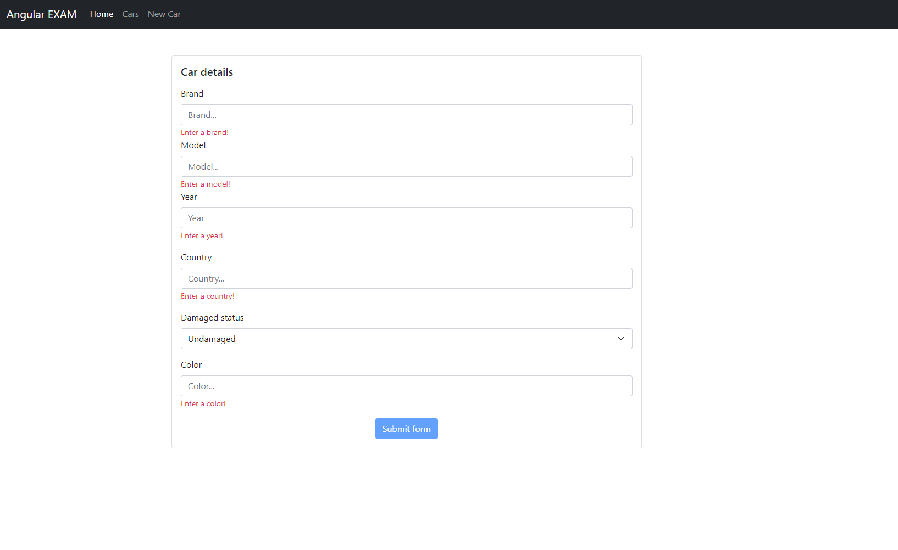
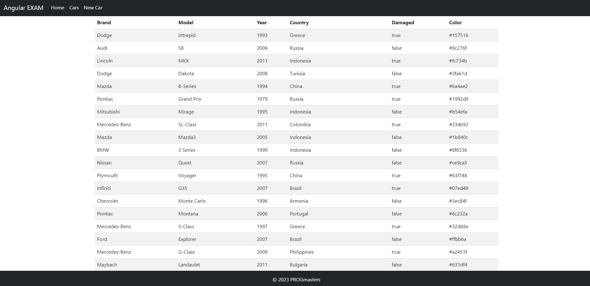

# Angular záróvizsga gyakorló feladat

## 1. Firebase hozzáadása a projekthez

Készíts egy Firebase projektet vagy használj egy meglévőt, majd konfiguráld az Angular projektet, hogy azt használja!

* Firebase projekthez egy webes alkalmazást adj hozzá. Ezt kösd össze az Angularral.
* Adatbázisnak `Firestore Database`-t használj!
* Ha már meglévő projektet használsz, NE legyen `cars` elnevezésű collection az applikációban!
* Ha új projektet hozol létre, NE felejtsd el hozzáadni a cloude firestore szolgáltatást!
* MINDEN esetben másold be a firebase projekted beállításaiból a firebase config részt az environment.ts és az environment.prod.ts-fájlokba

Az `AngularFire` csomag már hozzá van adva a projekthez, nem kell külön telepíteni.

Az Angular alkalmazás elindítása után a home oldalon található gombbal tudod alaphelyzetbe állítani az adatbázisodat.
Ez töröl minden eddigi adatot, majd feltölti az induló adatokat.

## 2. Új autó létrehozása 

Hozz létre egy új komponenst `car-form` néven, feladatod, hogy implementáld a képen látható formot! Submit gombra kattintva `CarModel` típusú objektumokat tudjunk az adatbázisba elmenteni!

* Az új komponens az `AppModule` része legyen!
* A form HTML template kialakításához a Bootstrap eszköztárát használd!
* A form a fenti navigációs sávon a `New Car` linkre kattintva legyen elérhető! (Routingot használj!)
* A form megvalósításához a `ReactiveFormsModule` eszköztárát használd!
* Minden mező legyen kötelező! (Year number típusú input mező legyen)
* A validációs üzeneteket akkor írd ki, ha a mező `dirty` és `invalid`!
  * Kivétel a `Damaged status`, ami egy Select mező
  * `Select`-en belül 2 opció legyen:
    * `Damaged`, hozzátartozó value: `true`
    * `Undamaged`, hozzátartozó value: `false`
* A submit gomb legyen letiltva, ha a form nincs megfelelően kitöltve!
* Hozd létre a `saveCar()` metódust a `CarService` osztályban, használd azt az új
  objektum mentéséhez, a submit gombra kattintáskor!

## 3. Autók listázása

Hozz létre egy új komponenst `car-list` néven, majd implementáld a képen látható táblázatot!

* Az új komponens az `AppModule` része legyen!
* A form HTML template kialakításához a Bootstrap eszköztárát használd!
* A táblázat a fenti navigációs sávon a `Cars` linkre kattintva legyen elérhető! (Routingot használj!)
* A táblázat sorainak megjelenítéséhez `async` pipe-ot használj, egy `Observable`-re se legyen explicit `subscribe()` hívás!
  * Ha így nem sikerülne megoldani a feladatot, akkor enélkül a feltétel nélkül is megvalósíthatod a táblázatot (25% pontlevonás)
* Hozd létre a `getCars()` metódust a `CarService` osztályban, ezt használd az adatok lekérdezéséhez!

